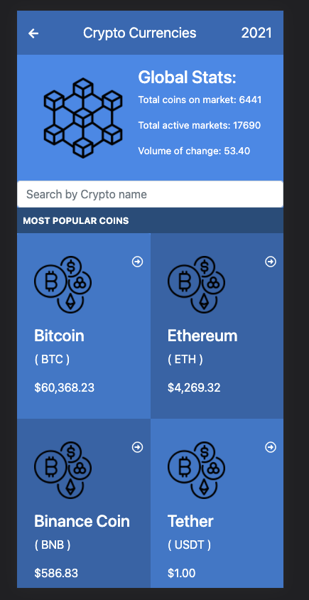

# Cryptocurrency Metrics WebApp

> In this project, I have build a mobile web application to check a list of metrics (numeric values) that I have created making use of React and Redux.




It is a Single Page App (SPA)

Informative Video: [Watch here!](https://www.loom.com/share/011938efc6204dc88463e5d69fe0c4fe)


## Built With

- HTML/CSS - React/Redux
- Git - Github - GitFlow


## Getting Started

To get a local copy up and running follow these simple example steps.

### Prerequisites

- Visual Studio Code or Sublime Text
- Git
- LiveServer Extension


### Setup

Go to the top of the page, press te green button that says "Code", and copy the link. Then you have to go to your console and type " git clone 'repository-url.com' ".

- Next step: Go to usage section!

### Install

No extra dependencies needed to use the code!

### Test

React/Redux Linters:
```
npx eslint .
```

CSS Testing:
```
npx stylelint "**/*.{css,scss}"
```

JavaScript Testing (JEST):
```
npm run test
```

### Usage

- Once you clone the repository:
```
cd repository-clone
```
- Run to install all dependencies: 
```
npm install
```
- Run to deploy website: 
```
npm start
```

You are ready to go!

### Live Demo Server

- Try it here!: [Crypto Metrics Website Netlify](https://crypto-metrics.netlify.app/)


## Author

👤 **Ramiro Aquistapace**

- GitHub: [@ramiaquista](https://github.com/ramiaquista)
- Twitter: [@ramiaq1](https://twitter.com/ramiaq1)
- LinkedIn: [RamiroAquistapace](https://www.linkedin.com/in/ramiro-aquistapace-32b61b204/)
## 🤝 Contributing

Contributions, issues, and feature requests are welcome!


## Show your support

Give a ⭐️ if you like this project! 😄

## Acknowledgments

👤  **Credits: Nelson Sakwa**

- License: [Nelson Sakwa](https://www.behance.net/gallery/31579789/Ballhead-App-(Free-PSDs))
